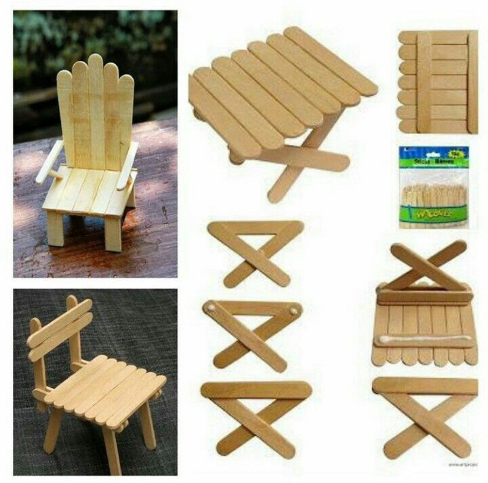

# Möbelbau – Projektangebote für WP Technik 7

Anschluss an „Vom Baum zum Brett“ · Planungsstand: 04.10.2026

Dieser Katalog stellt **21 Projektangebote** nach steigendem Anspruch vor. Er dient zunächst der Auswahl durch die Lehrkraft. Die kurzen Projektaufträge können anschließend für die Lernenden genutzt werden. Die Nummern P01–P21 sind neue Katalognummern; die Zuordnung zur ursprünglichen Ideensammlung steht am Ende.

**Leitfrage:** Wie kannst du aus Holz etwas bauen, das einen konkreten Bedarf erfüllt?

Anschluss an die [bestehende Unterrichtskonzeption](../UNTERRICHTSKONZEPT.md): Holz nach seinen Eigenschaften auswählen, Materialbedarf planen, Verschnitt berücksichtigen und die Funktion des fertigen Produkts prüfen. Entwürfe, Stücklisten und Reflexionen gehören in die Papiermappe; digitale Quellen unterstützen die Planung.

## Verbindlicher Werkstattrahmen für diese Auswahl

- Schülerinnen und Schüler nutzen **keine Kreissäge und keine Handkreissäge**. Auch Tischkreissäge, Tauchkreissäge und Kappsäge sind für ihre Arbeit in diesem Katalog nicht eingeplant.
- Als Sägemaschinen sind nach der Vorgabe für diesen Kurs ausschließlich **Pendelhubstichsäge und Dekupiersäge** vorgesehen. Hinzu kommen geeignete Handsägen.
- Maschinenwahl richtet sich nach Werkstückgröße, Materialstärke und sicherer Führung: Dekupiersäge für geeignete kleine, dünne Teile; Pendelhubstichsäge für ausreichend große, sicher gespannte Werkstücke. Kleine Leisten mit einer geeigneten Handsäge bearbeiten.
- Standardbreiten und fertig gekaufte Leistenquerschnitte bestimmen die Konstruktion. Keine Serien schmaler Streifen, keine langen Gehrungsleisten, keine eingesägten Nuten und keine aus Großplatten zerlegten Möbelsätze.
- **Einzelne Vorbereitungsschnitte durch die Lehrkraft sind möglich**, etwa die wenigen Querschnitte für einen Berliner Hocker. Sie werden beim jeweiligen Projekt benannt. Umfangreichen Zuschnitt an einen Baumarkt auszulagern, macht ein ungeeignetes Projekt nicht zu einem geeigneten Schülerprojekt.
- Bohren, Schrauben, Spannen und Schleifen ergänzen die Sägearbeiten im Rahmen der eingeführten Werkstattverfahren.
- Verlinkte DIY-Seiten sind Quellen und Anregungen, keine automatisch freigegebenen Schüleranleitungen. Maßgeblich ist die hier beschriebene Schulvariante. Eventuell dort gezeigte Kreissägen, Fräsen oder andere Maschinen werden nicht übernommen.
- Tragende Möbel werden vor Nutzung von der Lehrkraft geprüft. Für Wandbefestigung, Kippsicherung und dauerhafte Aufstellung von Gemeinschaftsprodukten wird der tatsächliche Schulstandort berücksichtigt.

## Kosten richtig lesen

Die Beträge sind **grobe eigene Materialschätzungen für die jeweils beschriebene Schulvariante**, keine übernommenen Projektpreise der verlinkten Seiten und keine Angebote. Bezugsdatum der Recherche: 04.10.2026.

Enthalten sind anteilig neu gekauftes Holz, einfache Verbindungsmittel, Leim, Schleifmittel, eine einfache Oberflächenbehandlung, soweit sinnvoll, und ungefähr 15–20 % Materialreserve. Vorhandene Werkzeuge, Arbeitszeit, Versand und externe Zuschnittkosten sind nicht enthalten. Bei einer Sammelbestellung werden Reststücke und Verbrauchsmaterial über mehrere Werkstücke verteilt; beim Einzelkauf ganzer Platten und Packungen kann die tatsächliche Ausgabe höher sein. Vorhandene geeignete Holzreste können Kosten senken, sind aber nicht als kostenlos vorausgesetzt.

**Preisanker:** [BAUHAUS Pappelsperrholz 1.200 × 600 × 4 mm](https://www.bauhaus.info/sperrholzplatten/sperrholzplatte-fixmass-i/p/26015657) wurde bei der Recherche mit 8,45 € pro Platte ausgewiesen (11,74 €/m²). Das ist eine Orientierung für dünnes Modellholz, nicht für stärkeres Möbelholz. Für Leimholz und Leisten dienen die unten verlinkten Standardformate der Beschaffungsplanung; deren konkrete Marktpreise müssen vor Bestellung ermittelt werden.

Die Materialmengen bei den Angeboten sind **Kalkulationsannahmen**, noch keine fertigen Stücklisten oder statischen Bemessungen. Maße und Materialstärken werden nach der Projektauswahl endgültig festgelegt.

## Übersicht – nach Anspruch sortiert

**Stufe 1:** wenige Teile, überschaubare Verbindungen, kleine Funktionsprüfung.  
**Stufe 2:** mehrere passende Bauteile, maßhaltige Montage oder eigene Anpassung.  
**Stufe 3:** tragende Konstruktion, bewegliche Teile, komplexer Entwurf oder Abstimmung mehrerer Teams.

Innerhalb einer Stufe stehen die in der Regel leichter zugänglichen Angebote zuerst. Die Einstufung gilt für die hier beschriebene Variante in WP 7, nicht für sämtliche Ausführungen der Quellen.

| ID | Angebot | Stufe | Arbeitsform | Materialkosten ca. | Kosten beziehen sich auf |
|---|---|---:|---|---:|---|
| P01 | Sortierbox ohne Deckel | 1 | einzeln / zu zweit | 6–12 € | eine Box, ca. 20 × 15 × 8 cm |
| P02 | iPad-, Kopfhörer- und Stifteablage | 1 | einzeln / zu zweit | 8–18 € | eine Station, ca. 30 cm breit |
| P03 | Werkzeughalter für einen Arbeitsplatz | 1 | zu zweit | 8–18 € | ein Modul für 4–6 Werkzeuge |
| P04 | Kleine offene Aufbewahrungskiste | 1 | zu zweit | 12–25 € | eine Kiste, ca. 30 × 20 × 15 cm |
| P21 | Möbelmodelle aus Eisstielen | 1 | einzeln / zu zweit | 3–6 € | ein einfaches Modell; Gruppe 8–15 € |
| P05 | Designerstuhl im Modell | 2 | einzeln / zu zweit | 5–12 € | ein Modell im Maßstab 1:5 |
| P06 | Tisch und Sitzmöbel im Modell | 2 | zu zweit | 10–22 € | ein Tisch mit zwei Sitzmöbeln, 1:5 |
| P07 | Materialcaddy mit Griff | 2 | zu zweit | 15–30 € | ein Caddy, ca. 30 × 20 × 20 cm |
| P08 | Regalkasten / Bücherwürfel | 2 | zu zweit | 20–40 € | ein Modul, ca. 35 × 35 × 25 cm |
| P09 | Berliner Hocker | 2 | zu zweit | 20–35 € | ein Hocker nach Originalprinzip |
| P10 | Puppenbett mit geraden Seitenteilen | 2 | zu zweit | 12–25 € | ein Bett, ca. 40–45 cm lang |
| P11 | Abnehmbarer Schultisch-Organizer | 2 | zu zweit | 15–30 € | eine kleine Ablage inkl. einfacher Klemmen |
| P12 | Wildbienen-Nistmodul | 2 | zu zweit / zu dritt | 18–40 € | ein wettergeschütztes Modul, ca. 25 × 30 cm |
| P13 | Miniaturschrank mit Tür | 3 | zu zweit | 12–25 € | ein Schrankmodell, ca. 25–30 cm hoch |
| P14 | Mehrzweckmöbel in Originalgröße | 3 | zu zweit / zu dritt | 25–50 € | ein kleiner Hocker-/Ablageentwurf |
| P15 | Lernraum im Modell | 3 | Teams aus 3–4 | 25–50 € | ein Raumbereich auf ca. 60 × 40 cm |
| P16 | Einzimmerwohnung im Modell | 3 | Teams aus 3–4 | 30–60 € | eine Wohnung auf ca. 60 × 60 cm |
| P17 | Kleine Sitzbank mit Ablage | 3 | Teams aus 3–4 | 55–95 € | eine Bank, ca. 80–100 cm breit |
| P18 | Modulares Taschenregal | 3 | mehrere Zweierteams | 120–210 € | Gesamtprojekt mit vier Taschenfächern |
| P19 | Materialstation im vorhandenen Regal | 3 | mehrere Zweierteams | 55–100 € | vier Boxen, Beschriftung und einfache Halter |
| P20 | Pflanzkasten / niedriges Hochbeet | 3 | Teams aus 3–4 | 70–130 € | ein bodenoffener Kasten, ca. 100 × 60 × 40 cm |

## Stufe 1 – überschaubarer Einstieg

### P01 · Sortierbox ohne Deckel

**Dein Projekt:** Plane und baue eine Box für Schrauben, Dübel oder andere Kleinteile. Teile sie so auf, dass du den Inhalt schnell findest.

- **Schulvariante:** Offene Box mit stumpfen Verbindungen und aufgesetztem Boden; keine Nuten, Gehrungen oder Schiebedeckel. Trennwände sind eine Erweiterung.
- **Material/Kostenbasis:** ungefähr 0,15–0,25 m² Sperrholz in 6–8 mm, kleine Verstärkungsleisten, Leim; **6–12 € pro Box**.
- **Eigenarbeit:** Anzeichnen, passende Flächenteile sägen, Kanten nacharbeiten, trocken zusammenstellen, verleimen und prüfen.
- **Lehrkraftvorbereitung:** Allenfalls eine kleine Ausgangsplatte bereitstellen. Keine passgenauen Bauteilsätze vorfertigen.
- **Prüfung:** Die vorgesehenen Teile passen hinein; die Box steht eben; Verbindungen und Kanten sind sauber.
- **Quelle:** [Bosch: Aufbewahrungsboxen](https://www.bosch-diy.com/de/de/all-about-diy/aufbewahrungsboxen). **Adaption:** Nur die Grundidee der Box übernehmen; Deckelkonstruktion und besondere Verbindungen entfallen.

### P02 · iPad-, Kopfhörer- und Stifteablage

**Dein Projekt:** Baue einen festen Platz für dein iPad, deine Kopfhörer und deine Stifte.

- **Schulvariante:** Grundplatte, geneigte Rückenstütze und aufgeleimte Anschlagleiste. Keine gesägte oder gefräste Nut für das Tablet. Kleiner Stiftebehälter optional.
- **Material/Kostenbasis:** ungefähr 0,15–0,25 m² Sperrholz in 8–10 mm, kurze fertige Leisten, ggf. Rundstab, Leim und Schrauben; **8–18 € pro Station**.
- **Eigenarbeit:** Gerät mit Hülle vermessen, Pappmodell testen, Teile sägen, schleifen und montieren.
- **Lehrkraftvorbereitung:** Handliche Ausgangsformate; keine weiteren Vorbereitungsschnitte eingeplant.
- **Prüfung:** Das Gerät steht sicher, die Hülle passt und der Ladeanschluss bleibt erreichbar.
- **Quelle:** [Organizer mit Kopfhörerhalterung – Microsoft / Yeah Handmade](https://news.microsoft.com/de-de/kreativmitmicrosoft-schreibtisch-organizer/). **Adaption:** Abmessungen und Halterung für das Schul-iPad selbst entwickeln.

### P03 · Werkzeughalter für einen Arbeitsplatz

**Dein Projekt:** Baue eine übersichtliche Halterung für einen festgelegten Satz Werkzeuge. Zeige durch Beschriftungen, ob etwas fehlt.

- **Schulvariante:** Kleine Grundplatte mit angeschraubten Halteklötzen, fertigen Leisten und Bohrungen. Keine French-Cleat-Aufhängung und kein umfangreiches Regalsystem.
- **Material/Kostenbasis:** ungefähr 0,15–0,25 m² Sperrholz in 10–12 mm, 0,5–1 m fertige Leisten, Schrauben; **8–18 € pro Modul**.
- **Eigenarbeit:** Werkzeuge auslegen und vermessen, Halter planen, überschaubare Teile sägen, bohren, schleifen und befestigen.
- **Lehrkraftvorbereitung:** Grundplatte ggf. mit wenigen Schnitten bereitstellen; endgültige Wandmontage übernehmen.
- **Prüfung:** Werkzeuge lassen sich sicher entnehmen und zurücklegen; scharfe Bereiche sind passend geschützt.
- **Quelle:** [Holzhandwerk: Werkzeughalter](https://holzhandwerk-ak.de/werkzeughalter-selber-bauen/). **Adaption:** Einfache Halter auswählen, direkt auf die Grundplatte schrauben.

### P04 · Kleine offene Aufbewahrungskiste

**Dein Projekt:** Baue eine Kiste für Spiele oder Unterrichtsmaterial. Bestimme zuerst, was hineinpasst.

- **Schulvariante:** Gerader Korpus aus Brettern in fertiger Breite, Boden aufsetzen, Ecken mit Leisten verstärken. Ohne Deckel oder Schublade.
- **Material/Kostenbasis:** etwa 1–1,2 m Brettmaterial in ca. 15 cm Breite, ein Boden von ca. 30 × 20 cm, kurze Eckleisten und Schrauben; **12–25 € pro Kiste**.
- **Eigenarbeit:** Brettlängen bestimmen und ablängen, Boden sägen, vorbohren, verschrauben, schleifen.
- **Lehrkraftvorbereitung:** Einkauf passender Brettbreite; ggf. Bodenrohling einmal grob abtrennen.
- **Prüfung:** Inhalt passt, Boden trägt die geplante Füllung, Kiste lässt sich sicher greifen.
- **Quelle:** [Bosch: Holzkiste bauen](https://www.bosch-diy.com/de/de/all-about-diy/holzkiste-bauen). **Adaption:** Einfache offene Bauform mit stumpfen Verbindungen.

### P21 · Möbelmodelle aus Eisstielen

**Dein Projekt:** Plane und baue ein Möbelmodell aus Eisstielen. Wähle einen Stuhl, einen kleinen Tisch oder eine Bank. Nutze das Bild als Anregung und entwickle eine eigene Variante.

- **Anspruch:** Stufe 1 für einen fest verleimten Tisch oder eine einfache Bank; Stufe 2 für einen Stuhl mit Rücken- und Armlehnen oder eine passende Möbelgruppe. Ein beweglicher Klappmechanismus ist eine freiwillige Herausforderung auf Stufe 3.
- **Material/Kostenbasis:** Etwa 30–50 naturbelassene Holz-Eisstiele pro einfachem Modell, Holzleim, Schleifpapier und optional etwas Farbe; **3–6 € pro Modell**, bei anteiligem Verbrauch aus Sammelpackungen. Für einen Tisch mit zwei Stühlen ungefähr 100–150 Stiele und **8–15 € pro Möbelgruppe** einplanen. Planungswerte einschließlich kleiner Materialreserve, ohne Versand und Werkzeug.
- **Preisorientierung:** [100 Holz-Eisstiele, 114 × 10 mm](https://cake-outlet.de/Eis-Stiele-Sticks-100-Stueck-114-x10-mm) wurden bei der Recherche am 04.10.2026 mit 3,89 € angeboten. Vor Bestellung aktuellen Preis prüfen.
- **Schulvariante:** Lege ganze Stiele nebeneinander und verbinde sie auf der Unterseite mit zwei Querleisten aus Stielen. So entstehen Sitzfläche, Tischplatte oder Rückenlehne. Fertige zwei gleiche Seitenteile und verbinde sie mit der Fläche. Verleime Kreuzbeine zunächst fest; das Modell muss nicht klappbar sein.
- **Eigenarbeit:** Zeichne deinen Entwurf, zähle die benötigten Stiele und prüfe ihre Anordnung zunächst ohne Leim. Nutze eine einfache Pappschablone für gleiche Beine und Seitenteile. Verleime in Baugruppen, fixiere mit Klammern und lasse den Leim nach Herstellerangabe trocknen. Verbinde anschließend die Baugruppen und schleife scharfe Kanten.
- **Werkzeuge:** Lineal, Bleistift, Schleifpapier, kleine Klammern und ggf. eine feine Handsäge mit Spannhilfe. Ganze Eisstiele bevorzugen; kleine Teile nicht frei an Sägemaschinen führen. Für die Grundvariante sind keine Sägemaschinen nötig.
- **Lehrkraftvorbereitung:** Einheitliche Stiele und Leim bereitstellen, geeignete Spannhilfen zeigen und Trockenplätze organisieren. Keine Vorbereitungsschnitte mit Kreissägen nötig.
- **Planung:** Lege zuerst eine passende Modellfigur oder eine gemeinsame Modellgröße fest. Bei einem ausdrücklich maßstäblichen Modell rechne die Möbelmaße um; die Länge eines Eisstiels gibt nicht automatisch einen Maßstab vor.
- **Prüfung:** Steht dein Modell ohne Wackeln? Sind beide Seitenteile gleich? Halten die Leimflächen nach dem Trocknen? Passen Tisch- und Sitzhöhe zusammen? Erkläre, wie Querleisten und Diagonalen die Form stabilisieren. Das Ergebnis ist ein Modell, kein Sitzmöbel für Menschen.
- **Bildvorlage:** [Mitgebrachtes Beispielbild in voller Größe](bilder/eisstiel-moebel.jpg) – zeigt Stühle und einen Tisch aus Eisstielen mit Konstruktionsdetails. Vom Nutzer bereitgestellt; ursprüngliche Bildquelle nicht bekannt. Es ist eine Anregung, kein vollständiger geprüfter Bauplan.

## Stufe 2 – planen, anpassen und maßhaltig montieren

### P05 · Designerstuhl im Modell

**Dein Projekt:** Entwirf einen Stuhl für einen bestimmten Ort. Baue ihn im Maßstab 1:5 und erkläre seine Form.

- **Schulvariante:** Großzügiges Modell aus wenigen Flächenteilen, etwa nach dem Prinzip des Berliner Hockers; keine winzigen Zapfenverbindungen.
- **Material/Kostenbasis:** etwa 0,1–0,2 m² Sperrholz in 4–6 mm, etwas Modellleiste und Leim; **5–12 € pro Modell**.
- **Eigenarbeit:** Entwurf, Maßstabsrechnung, Pappversuch, Sägen mit der Dekupiersäge bei geeigneten Teilen, Schleifen und Leimen.
- **Lehrkraftvorbereitung:** Handliche Sperrholzformate, keine fertigen Einzelteile.
- **Prüfung:** Maßstab, Standfestigkeit und nachvollziehbare Nutzung. Das Modell ist kein belastbares Sitzmöbel.
- **Quelle:** [Berliner Hocker – Originalprojekt](https://hartzivmoebel.blogspot.com/p/berliner-hocker.html). **Entwurfsanregung:** Kein fertiger Modellbauplan.

### P06 · Tisch und Sitzmöbel im Modell

**Dein Projekt:** Baue einen Tisch mit zwei passenden Sitzmöbeln. Achte darauf, dass die Größen zusammenpassen.

- **Schulvariante:** Fertige Modellleisten und dünnes Sperrholz; einfache Rahmen und stumpf verleimte Verbindungen.
- **Material/Kostenbasis:** ca. 0,2–0,35 m² Sperrholz in 4–6 mm, 2–3 m Modellleisten und Leim; **10–22 € pro Möbelgruppe**.
- **Eigenarbeit:** Einheitlichen Maßstab 1:5 festlegen, Leisten mit der Handsäge ablängen, Plattenteile sägen und montieren.
- **Lehrkraftvorbereitung:** Einkauf fertiger Modellleisten; keine Leisten aus Platten schneiden.
- **Prüfung:** Sitz- und Tischhöhe passen zueinander; alle Möbel stehen ohne Wackeln.
- **Quelle:** [Bosch: Puppenhaus und Einrichtung](https://www.bosch-diy.com/de/de/all-about-diy/puppenhaus-selber-bauen). **Entwurfsanregung:** Möbelgruppe entwickeln, nicht den großen Hauskorpus nachbauen.

### P07 · Materialcaddy mit Griff

**Dein Projekt:** Baue eine tragbare Materialbox für eine Tischgruppe. Plane einen Griff und passende Fächer.

- **Schulvariante:** Offener Kasten mit zwei höheren Stirnteilen und gekauftem Rundstab als Griff; maximal eine einfache Trennwand.
- **Material/Kostenbasis:** ca. 0,3–0,45 m² Sperrholz in 8–10 mm, 30 cm Rundstab, kurze Eckleisten und Verbindungsmittel; **15–30 € pro Caddy**.
- **Eigenarbeit:** Material ausmessen, Konturen sägen, Griffbohrungen herstellen, schleifen und verbinden.
- **Lehrkraftvorbereitung:** Grobe, handliche Plattenformate; keine Nut- oder Serienzuschnitte.
- **Prüfung:** Griff hält die geplante Füllung; Inhalt fällt beim üblichen Tragen nicht heraus.
- **Quelle:** [Bosch: Holzkiste bauen](https://www.bosch-diy.com/de/de/all-about-diy/holzkiste-bauen). **Eigene Adaption:** Griff und Fächer sind zusätzlich zu planen.

### P08 · Regalkasten / Bücherwürfel

**Dein Projekt:** Baue ein Regalfach für Bücher. Lege vor dem Bau die Außenmaße mit den anderen Teams fest.

- **Schulvariante:** Vier Teile aus Standard-Leimholzbrett in ca. 25 cm Breite, stumpf verschraubt; eine aufgesetzte Rückwand unterstützt die Aussteifung. Kein Auftrennen von Platten in Streifen.
- **Material/Kostenbasis:** ungefähr 1,5 m Leimholzbrett in 25 cm Breite und 18 mm Stärke, kleine Rückwand, Schrauben und Leim; **20–40 € pro Modul**.
- **Eigenarbeit:** Materialstärken bei der Maßplanung beachten, wenige Querschnitte, bohren, senken, montieren und schleifen.
- **Lehrkraftvorbereitung:** Einzelne präzise Vorbereitungsschnitte bei Bedarf; Schülerarbeit bleibt wesentlich. Brettbreite an das tatsächlich verfügbare Standardformat anpassen.
- **Prüfung:** Rechtwinkligkeit, vorgesehene Buchlast und sichere Aufstellung. Stapeln erst nach geplanter Verbindung und Kippsicherung.
- **Quellen:** [HORNBACH macht Schule: Workbook mit Würfelregal](https://hornbach-macht-schule.de/wp-content/uploads/2022/04/4ED1_DayOne_Workbook_AW_mitFalz.pdf), alternativ [Bosch: Holzkisten](https://www.bosch-diy.com/de/de/all-about-diy/holzkiste-bauen). **Adaption:** Standardbrett-Konstruktion wie oben; das Workbook-PDF war beim direkten Abruf nicht zuverlässig erreichbar.

### P09 · Berliner Hocker

**Dein Projekt:** Baue einen Berliner Hocker. Untersuche anschließend, wie du ihn als Sitzmöbel oder Ablage nutzen kannst.

- **Schulvariante:** Originalprinzip aus vier Brettteilen; keine individuellen Nuten oder Gehrungen.
- **Material/Kostenbasis:** ein Leimholzbrett in ca. 30 cm Breite und 18 mm Stärke, ca. 1,5–1,6 m nutzbare Länge, zehn passende Schrauben, Schleifmittel und einfache Oberfläche; **20–35 € pro Hocker**.
- **Eigenarbeit:** Plan lesen, Teile und Schraubpositionen anzeichnen, vorbohren und senken, montieren, Kanten bearbeiten.
- **Lehrkraftvorbereitung:** Die wenigen geraden Querschnitte dürfen durch die Lehrkraft erfolgen. Schnittfugen berücksichtigen: Die rechnerische Summe der Bauteillängen ist nicht automatisch die ausreichende Einkaufsbrettlänge.
- **Prüfung:** Rechtwinkligkeit, Schraubverbindungen und Standfestigkeit; Freigabe als Sitzmöbel durch die Lehrkraft.
- **Quellen:** [Originalprojekt](https://hartzivmoebel.blogspot.com/p/berliner-hocker.html), [Bauplan als PDF](https://www.propsteijugendvorsfelde.de/fileadmin/user_upload/5Material/PDF-Download/Berliner-Hocker.pdf). Die historischen Preis- und Zeitangaben des Projekts gelten nicht als aktuelle Unterrichtskalkulation.

### P10 · Puppenbett mit geraden Seitenteilen

**Dein Projekt:** Baue ein Bett für eine Puppe. Miss vorher aus, wie lang und breit es sein muss.

- **Schulvariante:** Zwei Stirnteile, zwei Seiten und ein auf Leisten liegender Boden; zunächst ohne Wiegenkufen. Rundungen an Kopf- und Fußteil sind optional.
- **Material/Kostenbasis:** ca. 0,3–0,45 m² Sperrholz in 6–10 mm, fertige Auflageleisten, Leim und passende Verbindungsmittel; **12–25 € pro Bett**, ohne Matratze und Textilien.
- **Eigenarbeit:** Maße bestimmen, Konturen sägen, Leisten ablängen, verleimen bzw. verschrauben und schleifen.
- **Lehrkraftvorbereitung:** Nur handliche Plattenrohlinge. Keine Nut für den Boden vorfertigen.
- **Prüfung:** Puppe passt, Boden bleibt an seinem Platz, Kanten sind glatt.
- **Quelle:** [Talu: Puppenbett/Puppenwiege mit PDF](https://www.talu.de/puppenbett-selber-bauen/). **Adaption:** Gerade, vereinfachte Bettkonstruktion; für eine Wiege wäre eine zusätzliche Kippprüfung nötig.

### P11 · Abnehmbarer Schultisch-Organizer

**Dein Projekt:** Entwickle eine kleine Ablage für deinen Schultisch. Sie soll sich ohne Beschädigung wieder entfernen lassen.

- **Schulvariante:** Kleine offene Ablage mit fertigen geeigneten Klemmen; keine eng passenden selbst gesägten Klemmnuten und kein Schubladen-Organizer.
- **Material/Kostenbasis:** ca. 0,2–0,3 m² Sperrholz in 8–10 mm, fertige Leisten, zwei einfache passende Klemmen und Schutzauflagen; **15–30 € pro Ablage**.
- **Eigenarbeit:** Tisch vermessen, Pappmodell ausprobieren, Ablage sägen und verbinden, Befestigung testen.
- **Lehrkraftvorbereitung:** Tischgeeignete Klemmen auswählen; keine umfangreichen Zuschnitte. Verfügbarkeit preiswerter Klemmen vor Projektfreigabe prüfen.
- **Prüfung:** Beinfreiheit, sichere Befestigung und unbeschädigte Tischoberfläche; nur für leichte Arbeitsmaterialien.
- **Quelle:** [Organizer mit Halterung – Microsoft / Yeah Handmade](https://news.microsoft.com/de-de/kreativmitmicrosoft-schreibtisch-organizer/). **Nur Formanregung:** Die abnehmbare Tischbefestigung ist ein eigener Entwurfsauftrag und auf der Quellseite nicht gelöst.

### P12 · Wildbienen-Nistmodul

**Dein Projekt:** Baue eine Nisthilfe für Wildbienen. Begründe, welche Materialien du verwendest und wo sie stehen soll.

- **Schulvariante:** Kleiner Kasten aus Standardbrettern mit überstehendem Dach und geeigneten Niströhren bzw. einem geeigneten abgelagerten Hartholzblock. Keine dekorative Mischfüllung aus Zapfen und Stroh.
- **Material/Kostenbasis:** ca. 1–1,5 m Standardbrett, kleine Rückwand und Dach, geeignete Röhren bzw. Hartholz, Schrauben; **18–40 € pro Modul**.
- **Eigenarbeit:** Wenige Querschnitte, bohren, Kanten und Eingänge sorgfältig nacharbeiten, montieren.
- **Lehrkraftvorbereitung:** Geeignete Nistmaterialien beschaffen; dicke Hartholzblöcke bei Bedarf in wenigen Schnitten vorbereiten.
- **Prüfung:** Geeignete, glatte und hinten geschlossene Nistgänge sowie regengeschützte Aufstellung nach Fachquelle. Das Besiedeln erfolgt saisonal und ist kein kurzfristiges Bewertungskriterium.
- **Quellen:** [NABU Karlsruhe: Bauanleitung](https://www.nabu-ka.de/themen-und-projekte/insekten-naturg%C3%A4rten/wildbienen/), [NABU Dortmund: Hinweise als PDF](https://www.nabu-dortmund.de/fileadmin/pict_nabu/Garten_AG/BK_NABU_Tipps_zu_Insekten-Nisthilfen_V3_Endfassung.pdf).
- **Gemeinschaftsvariante:** Vier Module plus einfacher gemeinsamer Schutzrahmen: **ca. 100–220 € insgesamt**, ohne Fundament oder besondere Standortbefestigung. Der gemeinsame Rahmen erhöht die Planung auf Stufe 3.

## Stufe 3 – anspruchsvolle Entwürfe und Gemeinschaftsprojekte

### P13 · Miniaturschrank mit Tür

**Dein Projekt:** Baue einen kleinen Schrank mit einer Tür. Plane ihn so, dass die Tür sich gut öffnen lässt.

- **Schulvariante:** Korpus mit aufgesetzter Rückwand, ein fester Einlegeboden und eine aufliegende Tür mit kleinen Aufschraubscharnieren. Keine eingelassenen Beschläge, Schubladen oder Nuten.
- **Material/Kostenbasis:** ca. 0,3–0,4 m² Sperrholz in 6–8 mm, Leisten, zwei kleine Scharniere, Griff und Verbindungsmittel; **12–25 € pro Modell**.
- **Eigenarbeit:** Bauteile planen und sägen, rechtwinklig leimen, Scharniere positionieren und befestigen.
- **Lehrkraftvorbereitung:** Handliche Platten; ggf. Hilfestellung bei kleinen Beschlägen.
- **Prüfung:** Türbewegung, Fugen und Standfestigkeit. Schwierigkeit entsteht durch Passung und Montage, nicht durch Maschinenbedarf.
- **Quelle:** [Heimwerker.de: Puppenschrank](https://www.heimwerker.de/puppenschrank-selber-bauen/). **Adaption:** Einfacher Korpus und aufliegende Tür wie oben.

### P14 · Mehrzweckmöbel in Originalgröße

**Dein Projekt:** Entwickle ein kleines Möbel, das mindestens zwei Aufgaben erfüllt. Baue zuerst ein Modell und begründe deine Lösung.

- **Schulvariante:** Enger Materialrahmen: wenige Teile aus einem Standardbrett, orientiert am Berliner Hocker. Keine Klappmechanik, keine ausziehbaren Teile und keine beliebigen Großmöbel.
- **Material/Kostenbasis:** ca. 1,8–2,4 m Leimholzbrett in 25–30 cm Breite, Schrauben, Modellmaterial und Oberfläche; **25–50 € pro Möbel**.
- **Eigenarbeit:** Bedürfnisse klären, Entwürfe vergleichen, Modell testen, wenigen Bauteilen passende Maße geben, montieren.
- **Lehrkraftvorbereitung:** Entwurf vor Materialausgabe prüfen; nur wenige Querschnitte wie beim Hocker. Entwürfe mit umfangreichem Sonderzuschnitt werden vereinfacht.
- **Prüfung:** Beide Nutzungen vorführen; als Sitzmöbel nur nach Prüfung durch die Lehrkraft.
- **Quelle:** [Berliner Hocker: unterschiedliche Nutzungen](https://hartzivmoebel.blogspot.com/p/berliner-hocker.html). **Entwurfsanregung**, kein fertiger Bauplan für die Eigenentwicklung.

### P15 · Lernraum im Modell

**Dein Projekt:** Gestalte einen Bereich eines Lernraums. Baue passende Möbel und erkläre, wie dort gearbeitet werden kann.

- **Schulvariante:** Ein Bereich pro Team, z. B. Einzelarbeit, Austausch oder Materialausgabe; gemeinsame Grundplattenmaße, Maßstab vorzugsweise 1:10. Kein mehrgeschossiger Hauskorpus.
- **Material/Kostenbasis:** eine Grundplatte ca. 60 × 40 cm, zusätzlich ca. 0,4–0,6 m² dünnes Sperrholz, Modellleisten und einfache Gestaltungsmaterialien; **25–50 € pro Teambereich**.
- **Eigenarbeit:** Raumplanung, Maßstabsrechnung, kleine Möbel sägen, verbinden und anordnen.
- **Lehrkraftvorbereitung:** Grundplatten aus Mitnahmeformaten; maximal grobe Teilung. Keine Serienzuschnitte für Modellmöbel.
- **Prüfung:** Laufwege, Möbelgrößen und Nutzung passen zusammen. Teams stimmen Übergänge ab.
- **Quelle:** [Bosch: Puppenhaus und Einrichtung](https://www.bosch-diy.com/de/de/all-about-diy/puppenhaus-selber-bauen). **Entwurfsanregung:** Übertragung auf einen schulischen Lernraum.

### P16 · Einzimmerwohnung im Modell

**Dein Projekt:** Plane eine kleine Wohnung. Zeige, wie Wohnen, Schlafen und Arbeiten auf begrenztem Platz möglich sind.

- **Schulvariante:** Offene Grundplatte mit angedeuteten Wänden und wenigen Möbeln, Maßstab 1:10. Mehrfachnutzung über Umstellen oder Drehen, nicht über komplizierte Scharniere.
- **Material/Kostenbasis:** Grundplatte ca. 60 × 60 cm, ca. 0,5–0,8 m² dünnes Sperrholz, Modellleisten und Gestaltungsmaterial; **30–60 € pro Wohnung**.
- **Eigenarbeit:** Grundriss entwickeln, Maße umrechnen, Möbel fertigen und Nutzung erproben.
- **Lehrkraftvorbereitung:** Grundplatte bereitstellen; keine großen Hausbauteile zuschneiden.
- **Prüfung:** Alle geforderten Nutzungen sind möglich und ihre Abläufe nachvollziehbar.
- **Quellen:** [Bosch: Puppenhaus](https://www.bosch-diy.com/de/de/all-about-diy/puppenhaus-selber-bauen), [Berliner Hocker](https://hartzivmoebel.blogspot.com/p/berliner-hocker.html). **Eigener Entwurfsauftrag**, keine fertig verlinkte Wohnungsanleitung.

### P17 · Kleine Sitzbank mit Ablage

**Dein Projekt:** Plane eine kurze Sitzbank mit einer Ablage. Überlege, wodurch sie stabil wird.

- **Schulvariante:** Kurze Bank aus fertig gekauften, ausreichend dimensionierten Rahmenhölzern und Sitzbrettern in Standardbreite. Keine aus breiten Platten gesägte Lattenserie. Stumpfe Verbindungen mit geeigneter Aussteifung.
- **Material/Kostenbasis:** überschlägig 5–7 m gehobelte Rahmenhölzer, 2–3 m Sitz-/Ablagebretter, Verbindungsmittel und Oberfläche; **55–95 € pro Bank**.
- **Eigenarbeit:** Zeichnung und Stückliste, Querschnitte geeigneter Teile, bohren, montieren und nacharbeiten.
- **Lehrkraftvorbereitung:** Querschnitte und Verbindungen vorab festlegen; einzelne präzise bzw. für Schülerwerkzeuge ungeeignete Ablängschnitte übernehmen. Keine Längsschnitte. Passt die Konstruktion nicht zur verfügbaren Ausrüstung, nicht auswählen.
- **Prüfung:** Aussteifung, Verbindungen und Standsicherheit; Prüfung vor Nutzung durch die Lehrkraft.
- **Quelle:** [BAUHAUS: Sitzbank mit Ablage](https://richtiggut.bauhaus.info/inspiration/diy-ideen/sitzbank-mit-ablage-bauen). **Konstruktive Anregung:** Materialdimensionierung und Verbindungsausführung für die Schulbank gesondert festlegen.

### P18 · Modulares Taschenregal

**Dein Projekt:** Entwickle mit deinem Team ein Fach für Schultaschen. Stimmt die Maße mit den anderen Teams ab.

- **Schulvariante:** Vier einzelne, niedrige Module aus Standardbrettern. Kein großer Schrankkorpus mit vielen passgenauen Innenwänden. Zuerst ein Fach testen.
- **Material/Kostenbasis:** für vier Fächer überschlägig 7–9 m Leimholz in ca. 40 cm Standardbreite, Rückwände, Verbindungsmittel und Befestigung; **120–210 € für vier Fächer**, etwa **30–50 € pro Fach** plus ggf. gemeinsame Befestigung.
- **Eigenarbeit:** Tatsächliche Taschen vermessen, Innen-/Außenmaße unterscheiden, wenige gleiche Querschnitte pro Modul, bohren, verschrauben und schleifen.
- **Lehrkraftvorbereitung:** Gemeinsames Maßraster prüfen, einzelne nötige Referenzschnitte; keine zugeschnittenen Großplatten-Bausätze. Wenn Taschen nicht zum Standardformat passen, Entwurf ändern.
- **Prüfung:** Gefüllte Taschen passen und lassen sich entnehmen; Module sind ausgesteift und untereinander verbunden. Endgültige Aufstellung und ggf. Kippsicherung übernehmen Erwachsene.
- **Quellen:** [Würfelregal im Schul-Workbook](https://hornbach-macht-schule.de/wp-content/uploads/2022/04/4ED1_DayOne_Workbook_AW_mitFalz.pdf), alternativ [Bosch: Holzkisten](https://www.bosch-diy.com/de/de/all-about-diy/holzkiste-bauen). **Adaption:** Kein fertig geprüfter Bauplan für ein Schultaschenregal. Direkter PDF-Abruf des Workbooks war nicht zuverlässig.

### P19 · Materialstation im vorhandenen Regal

**Dein Projekt:** Gestaltet gemeinsam eine Materialstation. Baue mit deinem Team eine passende Box oder Halterung.

- **Schulvariante:** Vier offene Boxen plus einfache Halter und Beschriftungen. Das vorhandene Regal bleibt erhalten; kein neuer Schrankkorpus, keine passgenauen Schubkästen auf Auszügen.
- **Material/Kostenbasis:** vier Boxen nach P04, etwas zusätzliches Material für Halter und Schilder; **55–100 € für die gesamte Station**. Das bestehende Regal ist nicht eingerechnet.
- **Eigenarbeit:** Regal und Material vermessen, gemeinsame Formate festlegen, Boxen sägen und verbinden, Anordnung erproben.
- **Lehrkraftvorbereitung:** Nur handliche Platten bzw. Standardbretter; keine Serienzuschnitte enger Einschübe.
- **Prüfung:** Die Boxen lassen sich mit Spiel entnehmen, Beschriftungen sind eindeutig, die Abläufe funktionieren.
- **Quellen:** [Bosch: Holzkisten](https://www.bosch-diy.com/de/de/all-about-diy/holzkiste-bauen), [Bosch: Aufbewahrungsboxen](https://www.bosch-diy.com/de/de/all-about-diy/aufbewahrungsboxen). **Adaption:** Offene Boxen ohne Deckelmechanik. Die Gesamtkoordination begründet Stufe 3; einzelne Boxen liegen auf Stufe 1–2.

### P20 · Pflanzkasten / niedriges Hochbeet

**Dein Projekt:** Baue mit deinem Team einen Pflanzkasten für den Schulgarten. Überlege, wie ihr das Holz vor dauernder Nässe schützt.

- **Schulvariante:** Bodenoffener, niedriger Kasten aus Standardbrettern und fertigen Eckhölzern. Kein erhöhtes Beet auf Beinen, keine untere Schrankkonstruktion.
- **Material/Kostenbasis:** ca. 10–13 m Bretter in 10–15 cm Breite, ca. 1,6–2 m Eckhölzer, geeignete Schrauben und seitliche Schutzlage; **70–130 € pro Kasten**. Erde, Pflanzen, Standortarbeiten und besondere Untergrundmaßnahmen sind nicht enthalten.
- **Eigenarbeit:** Standort aufnehmen, Brettlängen bestimmen, geeignete Querschnitte sägen, vorbohren, verschrauben und Kanten bearbeiten.
- **Lehrkraftvorbereitung:** Stärkere Eckhölzer gegebenenfalls in wenigen Schnitten ablängen; keine Bretter längs auftrennen. Standardbreiten bestimmen die Gesamthöhe.
- **Prüfung:** Standfestigkeit, Ecken, offene Entwässerung nach unten und sinnvolle Trennung von feuchter Erde und Holz.
- **Quelle:** [Bosch: Hochbeet mit Stauraum](https://www.bosch-diy.com/de/de/all-about-diy/step-by-step-projects/hochbeet-bauen). **Nur Anregung:** Der komplexere Unterbau der Quelle entfällt vollständig; ein eigener einfacher Kastenplan ist erforderlich.

## Aus der ursprünglichen Auswahl gestrichen

| Ursprüngliche Nr. | Projekt | Entscheidung und Grund |
|---|---|---|
| 5 | Ausziehregal Nele | Entfällt: viele genau zusammenpassende Teile und hohe Anforderungen an wiederholbar rechtwinklige Zuschnitte; für diesen Katalog kein günstiges Verhältnis von Eigenarbeit und Vorbereitung. |
| 13 | Maßgeschneiderter Schreibtisch-Organizer von Holzhandwerk | Entfällt ausdrücklich: kleinteiliger Korpus, Schubladen und gesägte Nuten; in der Quelle u. a. Tischkreissägenarbeit. Kein erneutes Anbieten unter anderem Namen. |
| 18 | Selbst gefertigte French-Cleat-Werkzeugwand | Entfällt: systematisches Herstellen langer schräger Leisten verlangt umfangreichen passenden Zuschnitt. P03 nutzt einfache direkt verschraubte Halter und benötigt dieses System nicht. |
| 20 | French-Cleat-Schraubzwingenwagen | Entfällt: Fahrgestell, zahlreiche Halter und Winkelleisten ergeben zu viel Vorbereitungs- und Zuschnittaufwand. |

Auch bei den verbliebenen Angeboten entfallen die aufwendigen Originalvarianten: z. B. komplexer Hochbeetunterbau, großer Puppenhauskorpus, Boxen mit Nuten sowie aufgetrennte Lattenserien. Die günstigere Einordnung und die Kosten gelten ausschließlich für die beschriebene Schulvariante.

### Zuordnung zur ersten Ideensammlung

| Ursprüngliche Nummer | Neuer Katalogeintrag |
|---|---|
| 1 / 2 / 3 / 4 | P09 / P14 / P08 / P17 |
| 6 / 7 / 8 / 9 / 10 | P04 / P05 / P06 / P13 / P10 |
| 11 / 12 | P15 / P16 |
| 14 / 15 / 16 / 17 / 19 | P11 / P02 / P07 / P03 / P01 |
| 21 / 22 / 23 / 24 | P18 / P19 / P20 / P12 |

## Empfehlung für die erste Durchführung

- **Überschaubarer Einstieg:** P01 Sortierbox, P03 Werkzeughalter oder P04 offene Kiste.
- **Gemeinsames Möbelprojekt:** P09 Berliner Hocker, mit wenigen Vorbereitungsschnitten durch die Lehrkraft.
- **Individuelle Planung mit begrenztem Materialbedarf:** P05 Designerstuhl im Modell oder P07 Materialcaddy.
- **Kooperation mit Nutzen für die Schule:** P19 Materialstation; nach einem erfolgreichen Prototyp auch P18 Taschenregal.

Für alle Angebote kann derselbe Ablauf gelten: Bedarf klären → Skizze und Maße → Materialwahl und Stückliste → Freigabe des Plans → fertigen → Funktion prüfen → Verbesserungen und Reflexion. Das ist zunächst ein Projektkatalog, noch keine fertige Unterrichtsreihe oder freigegebene Sammlung von Bauplänen.

## Materialquellen zur späteren Kalkulation

- [BAUHAUS: Pappelsperrholz 1.200 × 600 × 4 mm](https://www.bauhaus.info/sperrholzplatten/sperrholzplatte-fixmass-i/p/26015657) – abgerufener Preisanker 8,45 € pro Platte; dünnes Modellmaterial.
- [HORNBACH: Leimholz Fichte 1.200 × 300 × 18 mm](https://www.hornbach.de/p/leimholzplatte-fichte-a-b-1200-x-300-x-18-mm/1061058/) – Beispiel eines Standardformats; für den Berliner Hocker ist diese Länge allein zu kurz.
- [HORNBACH: Rechteckleiste 2.000 × 40 × 20 mm](https://www.hornbach.de/p/konsta-rechteckleiste-kiefer-fichte-roh-2000-x-40-x-20-mm/5485738/) – Beispiel fertig gekaufter Querschnitte; keine pauschale Eignung als tragendes Bankbein.

Die übrigen Preisbereiche beruhen auf überschlägigen Materialmengen und bewusst breiten Budgetansätzen. Erst nach Auswahl und Bemessung eines Projekts folgt eine genaue Stückliste mit aktuellen lokalen Einkaufspreisen.
